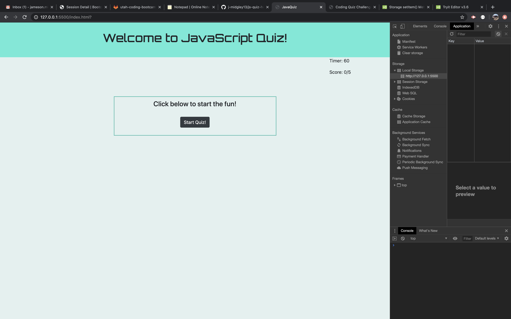
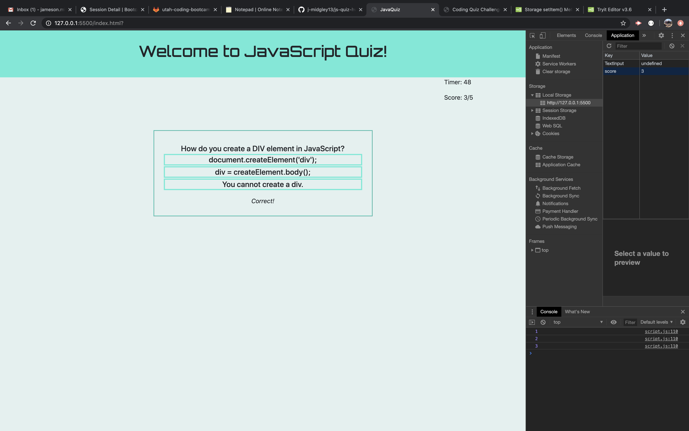
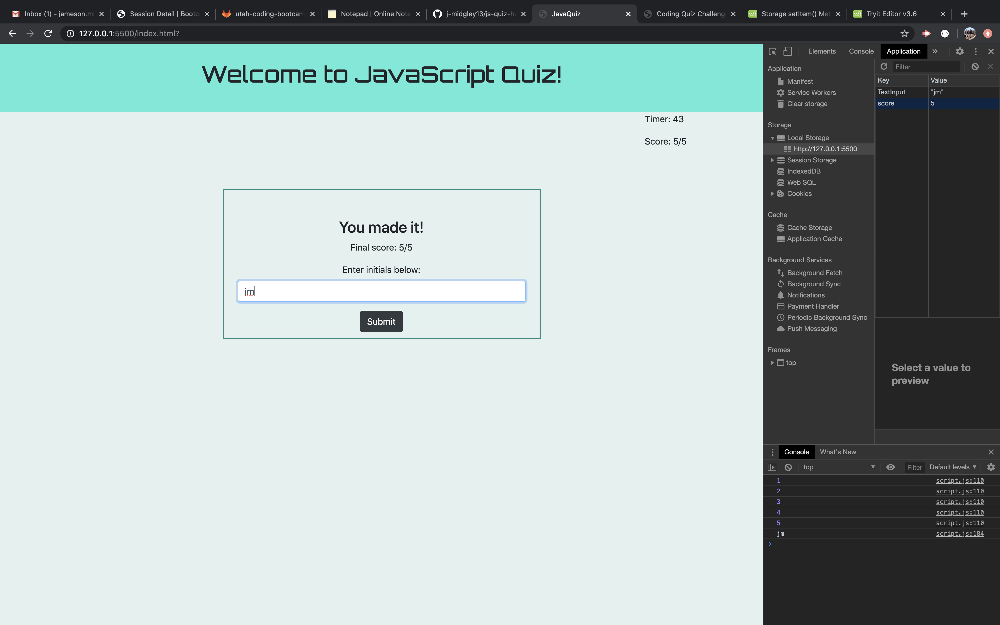

# js-quiz-hw4
-------------
## Introduction
-------------
Within this assignment, I have been tasked with building a timed quiz that asks questions about Javascript fundamentals. It should also store high scores.

## Criteria
-------------

Given I am taking the quiz:
 
When I click the start button
 
Then a timer starts and I am presented with a question
 
When I answer the question
 
Then I am presented with another question
 
When I answer a question incorrectly
 
Then time is subtracted from the clock
 
When all questions are answered or the timer reaches 0
 
Then the game is over
 
When the game is over
 
Then I can save my initials and score

## Summary
-------------
This homework was difficult for me to nail down. I was very overwhelmed at first by the amount of code I would have to write and got lost trying to figure out a place to start. I had some classmates and programmer friends really help me by pointing me in the right direction a few times. They showed me things that I can continue to implement for future use. One such thing was learning how to chunk up what I needed to do in a logical order. Focus only on one chunk at a time and move onto the next chunk. Come back to old code just to tweak or fit with newer code. Hardest week yet but still excited to learn!

## Links and Screenshots
-------------

[Link to JavaScript Quiz](https://j-midgley13.github.io/js-quiz-hw4/)

 

 

